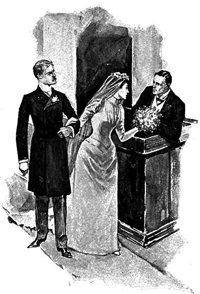

<h1>ADVENTURES OF SHERLOCK HOLMES</h1>

“THE GENTLEMAN IN THE PEW HANDED IT UP TO HER”

[Page 238

ADVENTURES 
 
OF 
 
SHERLOCK HOLMES

BY 
A. CONAN DOYLE 
<small>AUTHOR OF “MICAH CLARKE” ETC.</small>

<small>ILLUSTRATED</small>

NEW YORK 
 HARPER &amp; BROTHERS, FRANKLIN SQUARE

Copyright, 1892, by Harper &amp; Brothers.

<i>All rights reserved.</i>

<h2>CONTENTS</h2>

<table summary="contents">
<tr>
<th colspan="3" class="tdr2">PAGE</th>
</tr>
<tr>
<td class="tdr">I.</td>
<td class="tdl hang">&mdash;A SCANDAL IN BOHEMIA</td>
<td class="tdr2"><a href="chapter-01.html#i">3</a></td>
</tr>
<tr>
<td class="tdr">II.</td>
<td class="tdl hang">&mdash;THE RED-HEADED LEAGUE</td>
<td class="tdr2"><a href="chapter-02.html#ii">29</a></td>
</tr>
<tr>
<td class="tdr">   III.</td>
<td class="tdl hang">&mdash;A CASE OF IDENTITY</td>
<td class="tdr2"><a href="chapter-03.html#iii">56</a></td>
</tr>
<tr>
<td class="tdr">    IV.</td>
<td class="tdl hang">&mdash;THE BOSCOMBE VALLEY MYSTERY</td>
<td class="tdr2"><a href="chapter-04.html#iv">76</a></td>
</tr>
<tr>
<td class="tdr">     V.</td>
<td class="tdl hang">&mdash;THE FIVE ORANGE PIPS</td>
<td class="tdr2"><a href="chapter-05.html#v">104</a></td>
</tr>
<tr>
<td class="tdr">    VI.</td>
<td class="tdlv">&mdash;THE MAN WITH THE TWISTED LIP</td>
<td class="tdr2"><a href="chapter-06.html#vi">126</a></td>
</tr>
<tr>
<td class="tdr">   VII.</td>
<td class="tdl hang">&mdash;THE ADVENTURE OF THE BLUE CARBUNCLE</td>
<td class="tdr2"><a href="chapter-07.html#vii">153</a></td>
</tr>
<tr>
<td class="tdr">  VIII.</td>
<td class="tdl hang">&mdash;THE ADVENTURE OF THE SPECKLED BAND</td>
<td class="tdr2"><a href="chapter-08.html#viii">176</a></td>
</tr>
<tr>
<td class="tdr">    IX.</td>
<td class="tdl hang">&mdash;THE ADVENTURE OF THE ENGINEER’S THUMB</td>
<td class="tdr2"><a href="chapter-09.html#ix">205</a></td>
</tr>
<tr>
<td class="tdr">     X.</td>
<td class="tdl hang">&mdash;THE ADVENTURE OF THE NOBLE BACHELOR</td>
<td class="tdr2"><a href="chapter-10.html#x">229</a></td>
</tr>
<tr>
<td class="tdr">    XI.</td>
<td class="tdl hang">&mdash;THE ADVENTURE OF THE BERYL CORONET</td>
<td class="tdr2"><a href="chapter-11.html#xi">253</a></td>
</tr>
<tr>
<td class="tdr">   XII.</td>
<td class="tdl hang">&mdash;THE ADVENTURE OF THE COPPER BEECHES</td>
<td class="tdr2"><a href="chapter-12.html#xii">280</a></td>
</tr>
</table>

<h2>ILLUSTRATIONS</h2>

<table summary="Illustrations">
<tr>
<td class="tdl hang">“THE GENTLEMAN IN THE PEW HANDED IT UP TO HER”</td>
<td class="tdr3" colspan="2"><a href="#frontis"><i>Frontispiece</i></a></td>
</tr>
<tr>
<td class="tdl hang">“A MAN ENTERED”</td>
<td class="tdc"><i>Facing&nbsp;p.</i></td>
<td class="tdr3"><a href="#man">8</a></td>
</tr>
<tr>
<td class="tdl hang">“THE DOOR WAS SHUT AND LOCKED”</td>
<td class="tdc">″</td>
<td class="tdr3"><a href="#door">40</a></td>
</tr>

<tr>
<td class="tdl hang">“ALL AFTERNOON HE SAT IN THE STALLS”</td>
<td class="tdc">″</td>
<td class="tdr3"><a href="#all">46</a></td>
</tr>

<tr>
<td class="tdl hang">“SHERLOCK HOLMES WELCOMED HER”</td>
<td class="tdc">″</td>
<td class="tdr3"><a href="#sherlock">60</a></td>
</tr>

<tr>
<td class="tdl hang">“GLANCING ABOUT HIM LIKE A RAT IN A TRAP”</td>
<td class="tdc">″</td>
<td class="tdr3"><a href="#glancing">72</a></td>
</tr>

<tr>
<td class="tdl hang">“THEY FOUND THE BODY”</td>
<td class="tdc">″</td>
<td class="tdr3"><a href="#they">80</a></td>
</tr>

<tr>
<td class="tdl hang">“THE MAID SHOWED US THE BOOTS”</td>
<td class="tdc">″</td>
<td class="tdr3"><a href="#maid">92</a></td>
</tr>

<tr>
<td class="tdl hang">“‘HOLMES,’ I CRIED, ‘YOU ARE TOO LATE’”</td>
<td class="tdc">″</td>
<td class="tdr3"><a href="#holmes2">122</a></td>
</tr>

<tr>
<td class="tdl hang">“AT THE FOOT OF THE STAIRS SHE MET THIS LASCAR SCOUNDREL”</td>
<td class="tdc">″</td>
<td class="tdr3"><a href="#at">134</a></td>
</tr>

<tr>
<td class="tdl hang">“‘HAVE MERCY!’ HE SHRIEKED”</td>
<td class="tdc">″</td>
<td class="tdr3"><a href="#have">172</a></td>
</tr>

<tr>
<td class="tdl hang">“‘GOOD-BYE, AND BE BRAVE’”</td>
<td class="tdc">″</td>
<td class="tdr3"><a href="#good">196</a></td>
</tr>

<tr>
<td class="tdl hang">“‘NOT A WORD TO A SOUL’”</td>
<td class="tdc">″</td>
<td class="tdr3"><a href="#not">214</a></td>
</tr>

<tr>
<td class="tdl hang">“‘I WILL WISH YOU ALL A VERY GOOD NIGHT’”</td>
<td class="tdc">″</td>
<td class="tdr3"><a href="#will">250</a></td>
</tr>

<tr>
<td class="tdl hang">“I CLAPPED A PISTOL TO HIS HEAD”</td>
<td class="tdc">″</td>
<td class="tdr3"><a href="#clapped">278</a></td>
</tr>

<tr>
<td class="tdl hang">“‘I AM SO DELIGHTED THAT YOU HAVE COME’”</td>
<td class="tdc">″</td>
<td class="tdr3"><a href="#delighted">292</a></td>
</tr>
</table>

