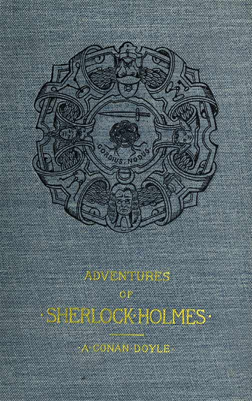

<body>

<pre>

Project Gutenberg's Adventures of Sherlock Holmes, by A. Conan Doyle

This eBook is for the use of anyone anywhere at no cost and with
almost no restrictions whatsoever.  You may copy it, give it away or
re-use it under the terms of the Project Gutenberg License included
with this eBook or online at www.gutenberg.org/license

Title: Adventures of Sherlock Holmes
       Illustrated

Author: A. Conan Doyle

Release Date: February 20, 2015 [EBook #48320]

Language: English

Character set encoding: UTF-8

*** START OF THIS PROJECT GUTENBERG EBOOK ADVENTURES OF SHERLOCK HOLMES ***

Produced by The Online Distributed Proofreading Team at
http://www.pgdp.net (This file was produced from images
generously made available by The Internet Archive/American
Libraries.)

</pre>

Ebook cover prepared by the transcriber and placed in the public domain.

